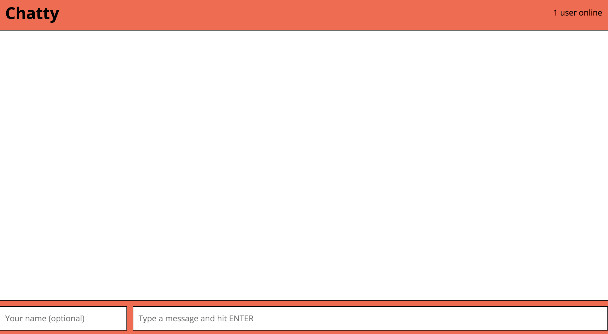
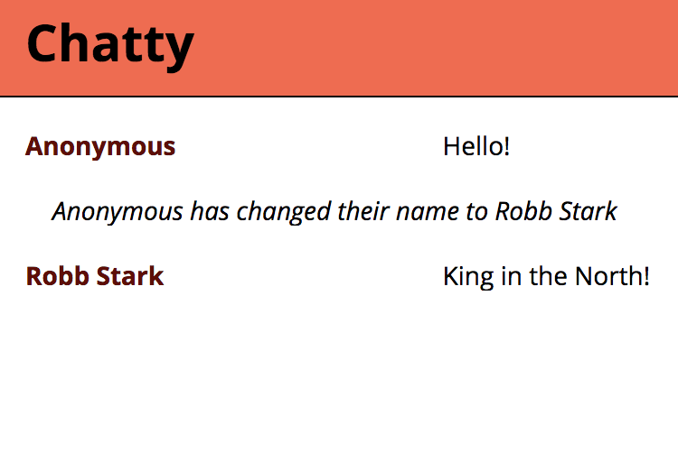
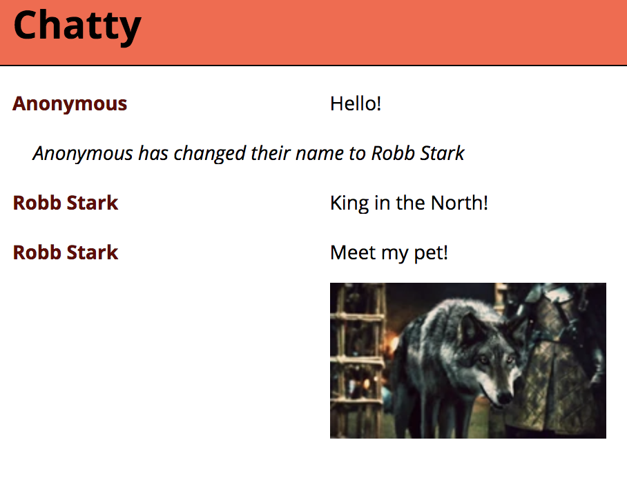

Chatty
=====================

A Next-Generation Chat Room

### Layout

Live version of this app at https://cy-chatty.herokuapp.com

This chat app is written in TypeScript on both front and back ends. The
project is neatly divided into `client` and `server` subdirectories. Within each, the TypeScript source is found in the `src` directory, while the transpiled JavaScript is emitted to the `dist` directory.

### Start

The TypeScript is already transpiled (using WebPack for the client-side, and the regular `tsc` compiler for the server-side). A simple `npm install` followed by `npm start` will run parallel processes of both client and server servers (yes, that's TWO servers!). You do not need to open a new terminal tab/window.

If you need to recompile the server TypeScript code, the command `npm run compile` will take care of that (Note: WebPack deals with the client-side transpilation).

### Features

##### Live Chat

Users can connect to the chat application at `http://localhost:3000` and will be met with the main chat interface:  

Other than the ability of sending chat messages via Web Sockets, the interface hosts a lot of cool features powered by the combined power of React and Express...

##### Users can change their names

A user can start chatting away anonymously, or they can fill out the username input field (bottom left) to adopt their own moniker.

##### Colourful chat output

Each connected user's nickname is assigned a random colour from a discrete selection of 4 sweet hues. Changing nicknames will not change that user's colour (in fact, the colour assignment is set by each client's IP address).

##### User Count

Users are always looking for the trendiest chat room, and so will always want to know how many people are around. Therefore, a user count of connected clients is displayed on the top right.

##### Chat messages... with pics!

Not to be outmatched by our competitors, Chatty allows a user to post pictures for everyone to see. By pasting a valid url ending with `.gif`, `.png` or `.jp(e)g`, Chatty's message parser will convert that to an image HTML tag and add it right after the content of the message (the html link is removed from that message).

##### Cached chat history

A newly connected client will receive the 10 last messages posted to the channel, courtesy
of our state-of-the-art Redis store! 

### Dependencies

* React
* Webpack
* tsc (TypeScript Compiler)
* [webpack-dev-server](https://github.com/webpack/webpack-dev-server)

Other dependencies can be found in the project's `package.json` file.
